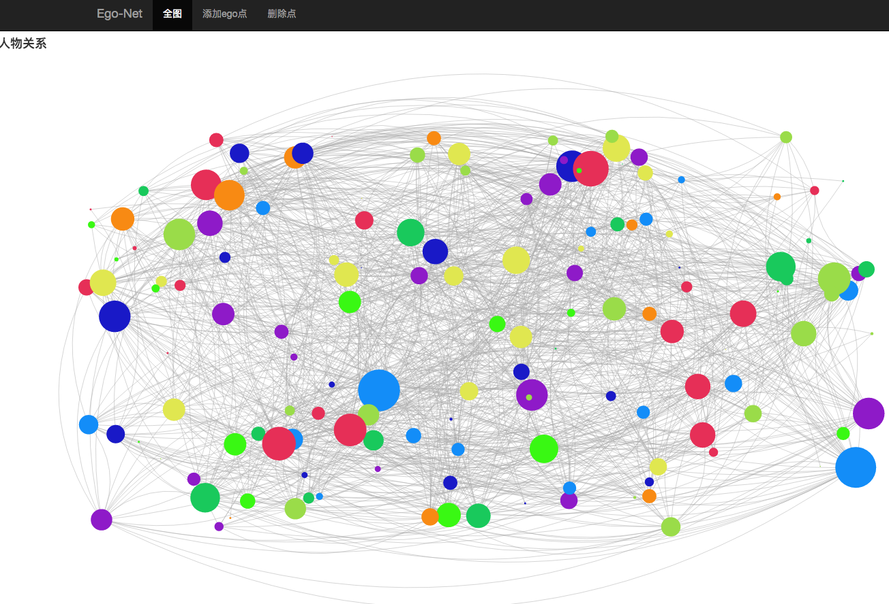
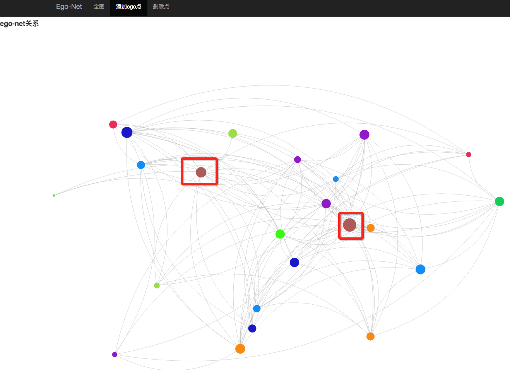
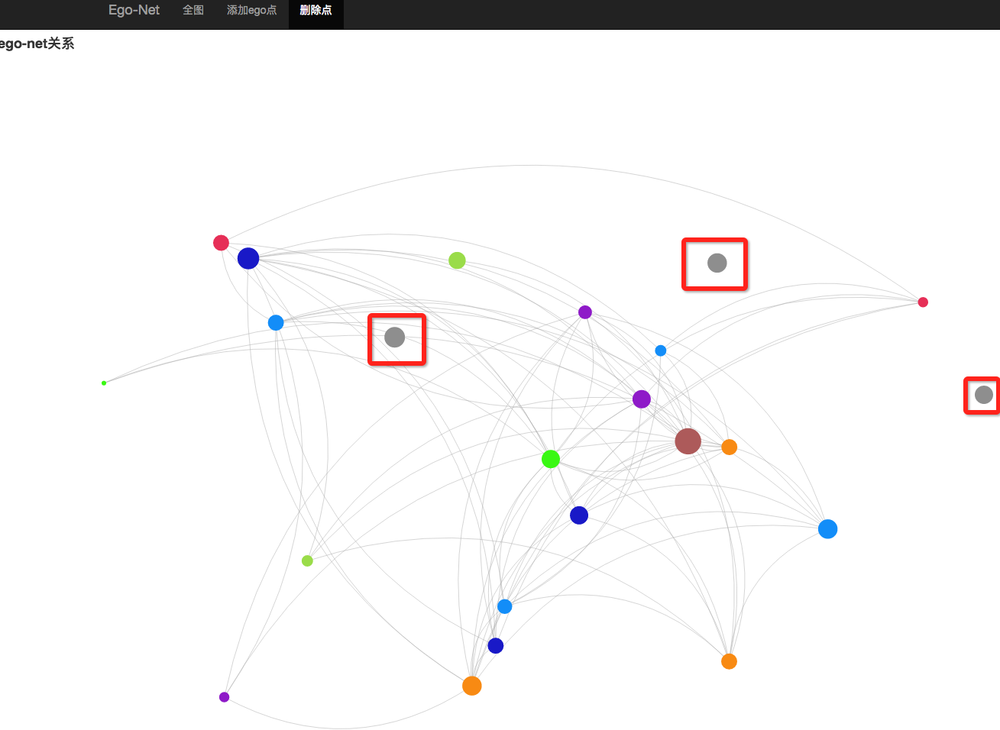

# ego-net
Ego-net Community Mining

##简介

ego-net项目主要实现了论文《Ego-net Community Mining Applied to Friend Suggestion. 2015 VLDB》[1]中的社区发现算法，并采用了真实的数据集在分布式集群上进行了相关的实验，并实现了数据可视化。

##实验环境

本次实验运行在三节点的Spark[2]集群上，原始数据存储在HDFS[3]上。

* 操作系统：Ubuntu 14.04
* 处理器：Intel(R) Core(TM) i7-4790 CPU @ 3.60GHz
* 内存：32GB x 3
* Spark：2.0.2
* Hadoop：2.6
* Java：JDK 1.8
* Python：3.5
* 数据来源：Facebook[4]，一共有4039个顶点，88234条边。

## Ego-net计算使用方法
对于一个给定的图，可以用Spark来计算图中每个点的ego-net，具体方法如下

```
cd bin/

/xxx/spark/bin/spark-submit --class com.corp.algorithm.SparkJob --master spark://host:port --jars spark-ego-net.jar spark-job.jar 输入文件路径 Application名称 顶点数 输出JSON文件名
```


## 数据可视化

对于已经计算好的ego-net数据，可以用下面的方式进行交互操作

```
cd data-generator/

python3 main.py
```

在浏览器中输入http://localhost:5000，可以看到



查看某个点的ego-net，先点击导航栏上“添加ego点”，然后点击图中的点，被选中的点会用暗红色标红



想要删除某个点和它关联的边，可以在导航栏上点击“删除点”，然后点击图中的点，删除的点会用灰色标出



##参考资料

* [1]. Alessandro Epasto. Silvio Lattanzi. Vahab Mirrokni. Ismail Oner Sebe. Ahmed Taei. Sunita Verma. Ego-net Community Mining Applied to Friend Suggestion. 2015 VLDB.
* [2]. Apache Spark. http://spark.apache.org
* [3]. Apache Hadoop. http://hadoop.apache.org
* [4]. ego-facebook. https://snap.stanford.edu/data/egonets-Facebook.html